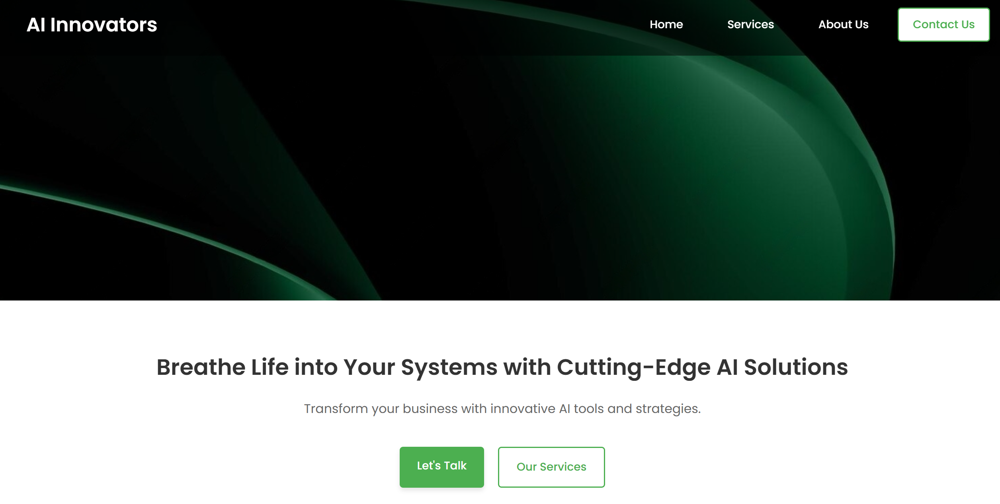

# Personal Website

Welcome to my personal website! This website is a showcase of my work and skills in UI/UX design and web development. I designed the layout and user experience in Figma before translating it into a fully functional website using HTML, CSS, and JavaScript. The website contains several pages, each focusing on different aspects of the services I offer, as well as information about my company and its processes.

## Live Pages
- [Home Page](https://yeswanthvarmagottumukkala.github.io/personalwebsite/home.html)
- [Services Overview Page](https://yeswanthvarmagottumukkala.github.io/personalwebsite/ai.html)
- [About Us Page](https://yeswanthvarmagottumukkala.github.io/personalwebsite/eff.html)
- [Service Details Page](https://yeswanthvarmagottumukkala.github.io/personalwebsite/ss.html)

## Page Previews

### Home Page
The Home Page serves as the main landing page, offering an introduction to my website, key services, and a brief overview of what my company offers.

### Services Overview Page
This page highlights the core services I offer, including autonomous agent development, enterprise consulting, and chatbot development. It gives visitors a brief overview of the services that can be explored further.

### About Us  Page
The About Us Page dives deeper into my artificial intelligence services. It showcases the value and impact of AI-driven solutions such as workflow automation, natural language processing, and other AI applications.

## Features and Highlights

- **Designed in Figma**: I initially designed the website layout in Figma, paying close attention to the visual design and user experience. The Figma designs were then converted into HTML, CSS, and JavaScript to bring the site to life.

- **Interactive UI/UX Design**: The website's design is built with interactivity in mind. Clickable service cards, dynamic transitions, and a smooth browsing experience all contribute to a polished, user-friendly design.

- **Clear Service Structure**: The website features a well-organized structure where visitors can quickly navigate between different service offerings, company details, and case studies.

- **User Engagement**: Features like service cards that expand to reveal more details ensure an engaging experience that invites users to explore the services and company more deeply.

- **Professional Aesthetic**: The design maintains a modern, clean, and professional aesthetic, focusing on clear typography, simple navigation, and balanced visuals.

Feel free to explore the pages of the website and see how my design and development skills have come together to create a seamless, interactive experience.
